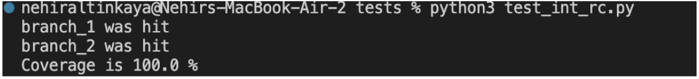
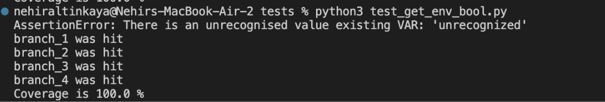
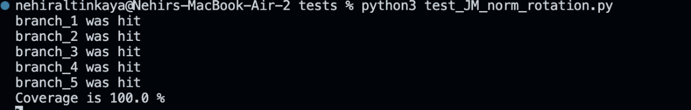
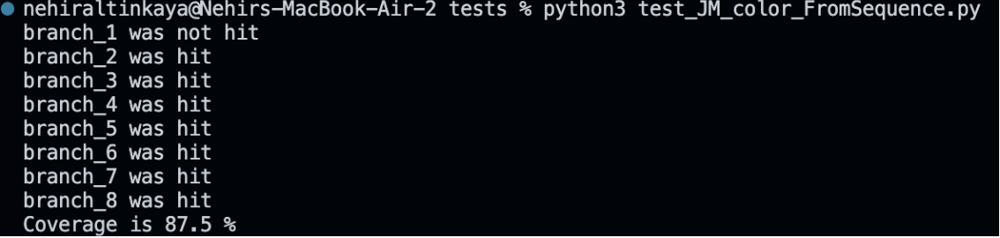
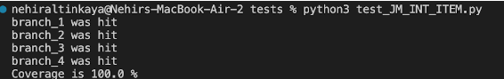
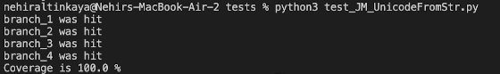
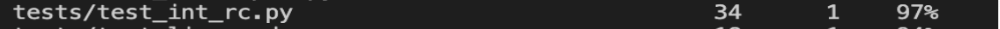
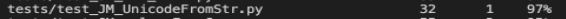

# Report for Assignment 1

## Project chosen

Group 36

Name: PyMuPDF

URL: https://github.com/pymupdf/PyMuPDF

Number of lines of code and the tool used to count it: 41754, Lizard

Programming language: Python

## Coverage measurement

### Existing tool

We have used the tool Coverage.py and executed it simply with the command “coverage run -m pytest” followed by “coverage report” and “coverage html” to extract the coverage data from the tests. We have obtained the following data:

Figure 1: Coverage Result by Existing Tool (first part)

Figure 2: Coverage Result by Existing Tool (second part)

### Your own coverage tool
Nehir Altinkaya:
int_rc:
		Link:
https://github.com/misraozoktas/sep_group36_pymupdf/blob/bbe7db8881b4684f3206fbf6afa95852c5f56061/tests/test_int_rc.py
Screenshot of the Coverage Results Output:

get_env_bool:
		Link:
https://github.com/misraozoktas/sep_group36_pymupdf/blob/bbe7db8881b4684f3206fbf6afa95852c5f56061/tests/test_get_env_bool.py
		Screenshot of the Coverage Results Output:

Turkan Badalzade:
	JM_norm_rotation:
		Link:
https://github.com/misraozoktas/sep_group36_pymupdf/blob/1a52e6554580bda141eb44f34f6dc49aa2937e5e/tests/test_JM_norm_rotation.py
		Screenshot of the Coverage Results Output:
    

	JM_color_FromSequence:
		Link:
https://github.com/misraozoktas/sep_group36_pymupdf/blob/1a52e6554580bda141eb44f34f6dc49aa2937e5e/tests/test_JM_color_FromSequence.py
		Screenshot of the Coverage Results Output:
    

Erin Elagoz:
	set_stream:
		Link:
https://github.com/misraozoktas/sep_group36_pymupdf/blob/8476e20fffc47eff0a310b06ac5540e0f0141cd2/tests/test_set_stream.py
		Screenshot of the Coverage Results Output:
.png)

	get_env_int:
		Link:
https://github.com/misraozoktas/sep_group36_pymupdf/blob/8476e20fffc47eff0a310b06ac5540e0f0141cd2/tests/test_get_env_int.py

		Screenshot of the Coverage Results Output:
.png)

Misra Ozoktash:
	JM_INT_ITEM:
		Link:
https://github.com/misraozoktas/sep_group36_pymupdf/blob/30971c7254454080a7a691ff2133209d9edc7d79/tests/test_JM_INT_ITEM.py
		Screenshot of the Coverage Results Output:
  

	JM_UnicodeFromStr:
		Link:
https://github.com/misraozoktas/sep_group36_pymupdf/blob/30971c7254454080a7a691ff2133209d9edc7d79/tests/test_JM_UnicodeFromStr.py
		Screenshot of the Coverage Results Output:
  

## Coverage improvement

### Individual tests

Nehir Altinkaya:
	int_rc:
		Link:
https://github.com/misraozoktas/sep_group36_pymupdf/commit/32b4a9c23be4f3435234e569a1a8208ec1d66fd0

		Screenshot of the Old Coverage Results:

		Screenshot of the New Coverage Results:

Reason for Coverage Improvement:
The coverage has improved by 2% as can also be seen from the images above. The coverage has improved when functions were made for test cases and new test cases were added as functions for covering different branches. For instance, when the case “is not positive or zero”, an improvement has been observed. 

get_env_bool:
		Link:
https://github.com/misraozoktas/sep_group36_pymupdf/commit/32b4a9c23be4f3435234e569a1a8208ec1d66fd0

		Screenshot of the Old Coverage Results:

		Screenshot of the New Coverage Results:

Reason for Coverage Improvement:
The coverage has improved by 6% which can also be seen from the images above. An improvement was observed in the coverage when  functions were made for test cases and new test cases were added to the test file, as functions, for covering different branches. For example, there were improvements in the coverage when the test cases for the branches returning true, returning false, returning default and returning assertion were added individually . 

Turkan Badalzade:
test_JM_norm_rotation:
		Link:
https://github.com/misraozoktas/sep_group36_pymupdf/commit/d089b154783fa50ce27508faf8d5260c8508b9cb

		Screenshot of the Old Coverage Results:
   

		Screenshot of the New Coverage Results:
   

Reason for Coverage Improvement:
The coverage result has improved by 1%. Even though it was already a high result, I was able to upgrade the code by adding new test cases. When I first implemented the test cases I did not give much attention to negative number cases. Therefore, to be able to increase my coverage result I added negative number cases. In addition to that I added a function that the number is below 0 and also not divisible by 90 when I added 360 to the negative number. So, I tried to hit every branch with my new test cases.

test_JM_color_FromSequence:
		Link:
https://github.com/misraozoktas/sep_group36_pymupdf/commit/d089b154783fa50ce27508faf8d5260c8508b9cb

		Screenshot of the Old Coverage Results:
   

		Screenshot of the New Coverage Results:
   

Reason for Coverage Improvement:
Firstly, the coverage result was 86% when I first ran the test function. While I was trying to improve the result I noticed that the test cases do not hit branch 2. Therefore, I had to add a new test case for branch 2. When I created the test case for branch 2, I observed a significant raise to 95%. Although I added a lot of test cases for this test function, I could increase it to 97%. Overall, the coverage result was increased by 11%.

Erin Elagoz:
set_stream:
		Link:
https://github.com/misraozoktas/sep_group36_pymupdf/commit/aea7bb3128d968662b2deaf6db96459ee153aab2

		Screenshot of the Old Coverage Results:
.png)

		Screenshot of the New Coverage Results:
.png)

Reason for Coverage Improvement:
The coverage results were increased by %6 after making functions for each test and calling them. All the if cases were being executed except the first one which was “If t is None”. After adding the last test case where t has the value “none”, the first case is also executed and the coverage further increased.

get_env_int:
		Link:
https://github.com/misraozoktas/sep_group36_pymupdf/commit/aea7bb3128d968662b2deaf6db96459ee153aab2

		Screenshot of the Old Coverage Results:
.png)

		Screenshot of the New Coverage Results:
.png)

Reason for Coverage Improvement:
The coverage results were also increased by %9 in this test after writing separate functions for each test and calling them, which was the main reason. Additionally, I have added a test case to further improve the coverage result. I have changed the variable so that the returned integer is different, making sure all the if cases have been executed.

Misra Ozoktash:
JM_INT_ITEM:
		Link:
https://github.com/misraozoktas/sep_group36_pymupdf/commit/4a3da66b36ba65331044bdedd36796cc83f19353

		Screenshot of the Old Coverage Results:
  

		Screenshot of the New Coverage Results:
  

Reason for Coverage Improvement: 
As it can be seen from the screenshots above, there has been a 8% increase on the coverage test result from 89% to 97%. This is a result of adding a number of functions of different test cases that are for covering different branches. I have made sure to add at least one test case for each branch. For example, there was an improvement in the coverage when a function was added to check the test case for an empty object.

JM_UnicodeFromStr:
		Link:
https://github.com/misraozoktas/sep_group36_pymupdf/commit/4a3da66b36ba65331044bdedd36796cc83f19353

		Screenshot of the Old Coverage Results:
  

		Screenshot of the New Coverage Results:
  

Reason for Coverage Improvement: 
An improvement can be seen from the screenshots above that the percentage result of the coverage test increased from 95% to 97%, a 2% increase. Even though the test was already a high result, with the improvements made to the code, a percentage rise is achieved. To achieve these results, I have added different functions that have at least one test case for each branch, making sure that all branches have been covered. For example, a test case has been written for a byte that will return a result of the decoded version of the byte. This has helped make an improvement in the coverage test.

### Overall

Here is the screenshot of the old coverage results by running an existing tool:

Figure 3: Old Coverage Result by Existing Tool (first part)

Figure 4: Old Coverage Result by Existing Tool (second part)

Here is the screenshot of the new coverage results by running the existing tool using all test modifications made:

Figure 5: New Coverage Result by Existing Tool (first part)

Figure 6: New Coverage Result by Existing Tool (second part)

## Statement of individual contributions
All Members: 
Firstly, all group members worked together to find a suitable project to be used by our group. When found, certain functions were identified and tests were created correspondingly. After the completion of all the tests, all team members contributed to necessary changes on all of the newly created test files whether related to names of the functions or altering test cases. Lastly, the coverage is measured and improvements are observed. After completion of the programming aspect of the assignment, all team members contributed to the “Readme” file of our Assignment 1 project. 

Nehir Altinkaya: 
During the assignment, I created the tests named as “test_int_rc.py” and “test_get_env_bool”. At first, the functions of these tests were found in the  “__init__.py” file. The coverage was observed after the creation and addition to the test files. After the tests were made depending on the branches of the functions, different functions were added within the test file corresponding to different test cases. In addition, naming of these functions have been altered depending on the requirement mentioned on the Gitbook guide for Assignment 1. The coverage is then observed again for the last time. 

Coverage Results: In general, the coverage result was 77 percent which improved to 79 percent at the end.
Device Used: Macbook Air M1

Turkan Badalzade:
I assisted my teammates to find a suitable project on github. After that, I called coverage html to observe the functions were not covered. I analysed the “__init.py__” file and found two functions to make the test functions. I created two files:  “test_JM_norm_rotation.py” and “test_JM_color_fromSequence.py”. After creating the functions I improved the coverage results as much as I could by adding new test cases. Furthermore, I helped my teammates when they had questions about the test  implementation part. In addition to that  I revised the functions according to the requirements on gitbook. Finally, I also contributed to the “Readme” file as our last step in Assignment 1. 

Coverage Results: In general, the coverage result was 78 percent which improved to 79 percent at the end.
Device Used: Macbook M1 Pro

Erin Elagoz:
In the beginning of the assignment I helped my team find a project that suits the guidelines and calculated the total lines of code using an existing tool (lizard). I have created “test_set_stream.py” and “test_get_env_int.py” files which contain 2 functions from the “__init__.py” file. Initially I calculated the coverage of these functions, then I improved them and calculated the coverage again to observe the increased coverage and uploaded the results as a screenshot to this document.

Coverage Results: In general, the coverage result was 77 percent which improved to 78 percent at the end.
Device Used: MSI - Windows 11
Misra Ozoktash:
At the beginning of the assignment, I helped my team find a suitable project on GitHub that meets the requirements of Assignment 1. During the assignment, I have created tests named “test_JM_INT_ITEM.py” and “test_JM_UnicodeFromStr.py”. The original version of the functions used to create these tests could be found in the “__init__.py” file. After creating these test files, the initial coverage tests were observed. Moreover, using the information gained from the coverage test results, several improvements have been made to both of the tests resulting in a rise of the coverage test percentages. To name some of these improvements, I have added several different test cases depending on the function, making sure that all of the branches have been tested at least once. Finally, I have checked the format of the code, files, functions and the function names to meet the requirements of Assignment 1. To make sure everything is in working order, the coverage test has been made once again.

Coverage Results: In general, the coverage result was 71 percent which improved to 72 percent at the end.
Device Used: Lenovo - Windows 11
